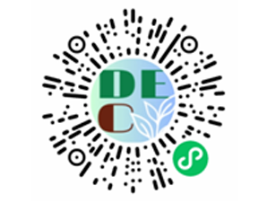

# DEC可持续饮食助手

## 项目介绍
本项目命名为`DEC：可持续饮食助手`，其中`DE`表示decrease，`C`表示carbon，该项目名称体现了本项目的核心思想，即通过尽量降低饮食活动中的碳足迹，达到可持续发展的目标。
本项目是由清华大学软件学院本科学生开发的纯公益项目。

## 如何访问


## 项目服务
本项目提供以下服务：
+ 对食物碳排放的科学计算
+ 个性化的食谱推荐
+ 面向每个用户的营养目标
+ 家庭饮食管理
+ 可持续饮食交流平台

## 项目目录
```
~/
├── README.md         
├── document/         # 项目文档
├── frontend/         # 前端
├── backend/          # 后端
├── internal_cross/   # 原型文件
├── model/            # 模型
├── static/           # 静态文件
```

## 现在的工作
我们正在为我们的服务添加AI辅助功能。
关于我们使用的模型，请参见`model/`目录：

## 备案信息
域名列表：`www.dechelper.com`

## 许可证
MIT License
